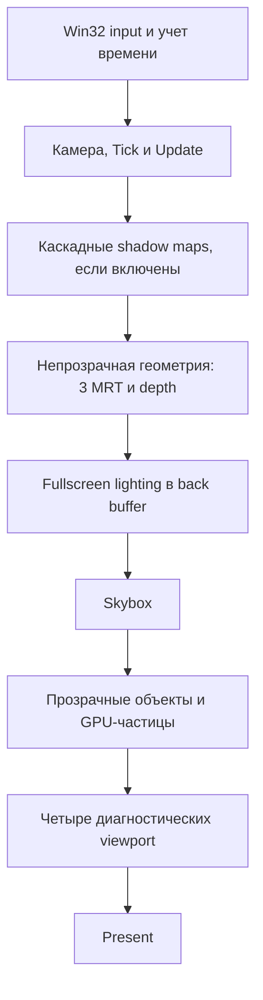

# Устройство проекта и рабочий пайплайн

Документ для разработчиков и их агентов. Состояние исходников на 12 сентября 2026 года; описание основано на чтении текущей рабочей копии, включая локальные изменения. Сборка и запуск не выполнялись. Подробности демонстрационных задач, состав сцен и их игровая логика намеренно опущены.

## 1. Что представляет собой проект

Это Windows-приложение на C++ с собственным небольшим компонентным движком и рендером Direct3D 11. В одном исполняемом проекте объединены окно, ввод, камера, объекты сцены, загрузка моделей и текстур, шейдеры, освещение, каскадные тени, инстансинг и GPU-частицы.

Архитектура объектная: сцена содержит наследников `GameComponent`, которые сами подготавливают свои данные и выполняют D3D-вызовы. Это не ECS, не отдельная библиотека движка и не система с графом рендер-проходов. На CPU обработка окна, обновление и отправка GPU-команд идут последовательно в основном потоке через один immediate context. Compute shaders частиц исполняются на GPU, но отдельной инфраструктуры асинхронной загрузки или фонового рендер-потока в ядре нет.

В коде есть три режима `RenderType`: `Forward`, `Deffered`, `Custom`. Написание `Deffered` и `DrawDeffered` — существующие имена API, их нужно учитывать при поиске.

Важная граница: `Game` хранит графические ресурсы и общие операции, но его виртуальные `Draw`, `DrawForward`, `DrawDeffered` пусты. Полная последовательность Forward/Deferred сейчас находится в `SunGame.cpp` внутри `SpecialGameClasses/SunSystem`. Этот файл необходим для понимания рендера независимо от происхождения каталога. `BaseGame` реализует только простой `Draw`; одного создания `Game` или `BaseGame` недостаточно для получения полного 3D-пайплайна.

## 2. Карта исходников

Все пути в таблицах этого документа указаны относительно корня репозитория, чтобы документ можно было передать вместе с копией проекта.

| Путь | Назначение |
|---|---|
| `AGENTS.md` | Правила работы агентов: сборка, запуск и тесты только по отдельной явной просьбе; тесты не добавляются автоматически |
| `1_Lab/1_Lab.sln` | Visual Studio solution, один C++-проект |
| `1_Lab/1_Lab.vcxproj` | Конфигурации MSBuild, исходники и заголовки |
| `1_Lab/Source/StartMain.cpp` | Точка входа, выбор реализации приложения, настройка и создание сцены |
| `1_Lab/Source/Public` | Объявления классов и структур |
| `1_Lab/Source/Private` | Реализации C++ |
| `Public/MainGame/BaseGameClass/Game.h`, соответствующий `.cpp` в `Private` | Жизненный цикл приложения, GPU-ресурсы, реестры компонентов, света и шейдеров, операции deferred и shadow |
| `Private/MainGame/SpecialGameClasses/SunSystem/SunGame.cpp` | Фактический порядок полного Forward/Deferred кадра |
| `Public/Components/GameComponents.h`, соответствующий `.cpp` | `GameComponent`, transform, константные буферы, обычный и инстансный draw |
| `Components/SpecificComponents` в `Public` и `Private` | Примитивы, `SphereComponent`, `FBXComponent`, `ParticleSystemComponent` |
| `Components/Light` в `Public` и `Private` | `PointLightComponent`, `SkyboxComponent`; ресурс cubemap объявлен в `Game.h` |
| `MainGame/Player.*` | Камера и обработка управляющего ввода |
| `Display/Display.*` | Win32-окно, `WindowProc`, доставка Raw Input |
| `InputDevice` | Состояние клавиш и мыши, делегаты |
| `1_Lab/Source/Shaders` | HLSL, компилируемый во время работы приложения |
| `1_Lab/Source/Models` | Модели и связанные ресурсы |
| `1_Lab/Source/includes/GLM-master` | Включенная в репозиторий копия GLM |

Пути с началом `Public`/`Private` в таблице относятся к `1_Lab/Source`. Сгенерированные каталоги `Debug`, `Release`, `x64`, `.vs`, `.idea`, временные файлы и установщики в корне не являются исходниками движка. Наличие файла в рабочей папке не означает, что он отслеживается Git и попадет другим разработчикам.

## 3. Окружение и перенос проекта

В `.vcxproj` указаны toolset `v143`, Windows SDK `10.0`, Unicode и конфигурации Debug/Release для Win32/x64. Стандарт языка явно не закреплен: используется `Default` там, где задан `LanguageStandard`.

Зависимости по исходникам:

| Зависимость | Использование и состояние |
|---|---|
| Windows API, Direct3D 11, DXGI, D3DCompiler, DirectXMath | Окно, устройство, swap chain, HLSL-компиляция, матрицы; в коде есть подключения `d3d11.lib`, `dxgi.lib`, `d3dcompiler.lib`, `dxguid.lib` |
| GLM | Векторы, кватернионы и вспомогательная математика; лежит в `Source/includes` |
| Assimp | Импорт моделей через `Assimp::Importer`; заголовки подключаются как `<assimp/...>` |
| stb_image | Декодирование изображений; `STB_IMAGE_IMPLEMENTATION` определен в `GameComponents.cpp` |

Самодостаточная установка Assimp и stb_image в репозитории не описана: явного manifest зависимостей и их версий не найдено, в проекте импортируются пользовательские `.props`. Нельзя считать наличие DLL в локальном `Debug` воспроизводимым способом установки. На новой машине нужно отдельно настроить include/lib/runtime для нужной конфигурации и разрядности.

Есть два конкретных ограничения переноса:

1. HLSL ищется по относительным путям вида `Source/Shaders/RotatedFigure.hlsl`. Рабочая директория процесса должна быть `1_Lab`, либо нужно осознанно изменить разрешение путей. Перенос одного `.exe` недостаточен: шейдеры и используемые assets нужны во время исполнения.
2. В `StartMain.cpp` корень assets выбирается между жестко заданными `E:/ComputerGraphic` и `O:/ITMO/ComputerGraphic`. Перед запуском на другой машине его необходимо адаптировать. Это текущая реализация, отдельного конфигурационного файла или asset locator нет.

Дополнительно в `.sln` конфигурация решения `Debug|x64` сопоставлена проекту `Release|Win32`. Поэтому подпись конфигурации решения сейчас не гарантирует фактическую разрядность и режим проекта. Исправление описано в документе «Правки».

## 4. Инициализация приложения

Логический путь запуска: `main → создание наследника Game → Initialize → настройка рендера и сцены → RegisterComponent → StartGame → Run`.

`Game::Initialize`:

1. Создает `Display`, который регистрирует Win32-класс и создает окно; связывает окно с `Game` через `GWLP_USERDATA`.
2. Создает `Player` и `InputDevice`, регистрирует Raw Input клавиатуры и мыши, показывает окно.
3. Заполняет описание swap chain и создает hardware D3D11 device, immediate context и swap chain. В Debug сначала пробует debug layer, при неудаче повторяет без него.
4. Создает depth texture с DSV/SRV, получает back buffer и создает RTV.
5. Проверяет наличие базового HLSL; `CreateBackBuffer`, несмотря на название, вызывает `InitShaderBuffers`: компилирует базовые VS/PS и создает input layout примитивов.
6. Создает blend states, deferred-ресурсы и shadow-ресурсы, затем вызывает виртуальный `AfterInitialize`.

Deferred и shadow ресурсы запрашиваются уже при инициализации, даже когда соответствующий режим не используется. `InitDeferredResources` также вызывается в deferred-кадре; при совпадении размеров и наличии ресурсов возвращает существующий набор, а не пересоздает его каждый кадр.

Инициализация пока не имеет надежного контракта успеха: `Initialize` возвращает `void`, часть ошибок лишь печатается, а некоторые промежуточные результаты не проверяются. Новый код не должен предполагать, что возврат из `Initialize` автоматически означает полностью готовый renderer.

## 5. Регистрация и жизненный цикл компонентов

Сигнатура регистрации:

```cpp
bool RegisterComponent(std::string Name,
                       GameComponent* component,
                       std::string PShaderName = {},
                       std::string VShaderName = {});
```

Порядок аргументов — сначала pixel shader, затем vertex shader.

`RegisterComponent` связывает объект с `Game`. Для `PointLightComponent` добавляет указатель в отдельный список `PointLights`; для остальных выбирает и назначает шейдеры и вызывает `CreateBuffers`. Затем пытается вставить объект в `Components`, представляющий собой `std::map<std::string, GameComponent*>`.

Вариант шейдера определяется **в момент регистрации**: в `Deffered` непрозрачным объектам, не являющимся skybox, назначается `DeferredGBuffer`; остальным — `Default`. Поэтому режим рендера нужно задавать до регистрации объектов. `SetRenderingType` после регистрации меняет только enum и не переназначает шейдеры.

Типичный порядок для примитива: создать объект → сформировать геометрию (`InitCube`, `InitSphere`, `InitSquare`/`InitPoints`) → зарегистрировать → кадры `Tick`, `Update`, `Render`.

Для импортируемой модели безопасный с учетом текущего кода порядок: создать `FBXComponent` → `SetGame` → `LoadModel` → при необходимости `LoadTexture` → `RegisterComponent` с подходящим FBX-шейдером. Загрузка использует устройство и может создавать GPU-буферы сразу. Загрузку до связывания с `Game` нельзя считать эквивалентной.

Разделение операций:

| Метод | Фактическая ответственность |
|---|---|
| `Tick(deltaTime)` | Поведение компонента; для сферы также обновление ее инстансов, для частиц сохранение шага симуляции |
| `Update()` | CPU-подготовка matrices/color/camera/lights/shadows и рекурсивное обновление `InstanceArray` |
| `Render(context)` | Назначение D3D-состояния, загрузка constant/instance data, draw; у частиц здесь же compute-симуляция и сортировка |
| `RenderShadow(...)` | Depth-only draw; у примитивов/FBX дополнительно вызывает `Update`, у частиц пуст |

Реестр не оформлен как владелец: используются raw pointers, удаления компонентов при разрушении `Game` нет, публичного unregister нет. Повторное имя не заменяет объект: результат `emplace` не проверяется, хотя метод возвращает `true`. Внешний код должен обеспечивать уникальность имен и не удалять зарегистрированный объект, пока реестр и связанные ссылки используют его.

## 6. Трансформации и камера

Локальные position/rotation/scale хранятся в GLM-типах, итоговые матрицы строятся через DirectXMath. В CPU-представлении используется `Scale * Rotation * Translation`; при наличии родителя — `local * parentWorld`. Euler-углы компонента перед построением матрицы переводятся из градусов в радианы. Есть отдельный путь кватернионного вращения.

`SetParentWithoutScale` исключает масштаб родителя при вычислении матрицы потомка. Защиты от циклов в иерархии нет. `GetCenter()` возвращает локальную `ComponentPosition`, поэтому это не универсальный способ получить мировую позицию дочернего объекта.

`GetWorldMatrix` кеширует матрицу корневого объекта через `bTransformDirty`; у дочерних объектов матрица пересчитывается с обращением к родителю. `SetPosition` сейчас сам не выставляет dirty-флаг: после него для надежного обновления корня требуется `MarkTransformDirty`. Не следует переносить это ограничение в новый API как желаемое поведение.

Перед загрузкой world matrix в HLSL она транспонируется. `Player` уже возвращает транспонированные view/projection. Шейдеры применяют `mul(position, matrix)`. Изменение соглашений нужно делать одновременно в CPU, HLSL, shadow, deferred и particle reconstruction, а не добавлением случайной транспозиции в одном месте.

Камера использует left-handed `LookAtLH`/`PerspectiveFovLH`, FOV 60°, near 0.1 и far 10000. Работают свободный и орбитальный режимы; ветка `ThirdPerson` в `UpdateCamera` сейчас вызывает обновление свободной камеры. Это не завершенная система камеры от третьего лица.

## 7. Ввод и цикл кадра

`Display::WindowProc` декодирует `WM_INPUT` и передает события в `InputDevice`. Клавиши хранятся в `unordered_set`, мышь предоставляет position, offset и wheel delta; `MouseMove` транслируется через multicast delegate. `Player` опрашивает это состояние. Ввод не является независимой системой команд/actions.

`Game::Run` обрабатывает очередь Win32-сообщений, измеряет `deltaTime` через `chrono`, вызывает `Game::Update`, очищает цвет/depth и выбирает виртуальный draw по `RenderType`.

Однако измеренное время пока не передается полному обновлению сцены: `Game::Update` обновляет счетчики/FPS, а конкретный Forward/Deferred draw вызывает камеру и `Tick` с `0.13f`. Это шаг на кадр, а не fixed timestep с накопителем. У частиц он дополнительно ограничивается до `0.05f`. Поэтому текущая скорость симуляции зависит от частоты кадров.

`EndFrame` выполняет `Present(1, 0)`, то есть запрашивает синхронизацию с обновлением экрана. FPS в заголовке обновляется раз в 0.5 секунды; `Objects` — размер реестра, а не число draw calls, мешей, инстансов или частиц.

## 8. Forward-пайплайн

Полная реализация в `SunGame::DrawForward` выполняет:

1. `ClearState`, восстановление rasterizer, viewport, input layout и topology; привязка back-buffer RTV и depth DSV.
2. Обновление камеры и проход `Tick/Update` по компонентам.
3. `RenderShadowMaps`, если включены тени; затем восстановление основного viewport, rasterizer и targets.
4. Отрисовка skybox-компонентов.
5. Отрисовка остальных компонентов в порядке ключей `std::map`. Для `HasOpacity` включается alpha blending и затем возвращается opaque blending.
6. Завершение кадра через `EndFrame`, сброс mouse offset.

Прозрачные объекты здесь не выделены в отдельный отсортированный список. Сортировка по расстоянию отсутствует; отключения записи depth для прозрачных объектов тоже нет. Для GPU-частиц это влияет и на корректность смешивания, и на доступную глубину для коллизий.

Основные forward-шейдеры вычисляют ambient, diffuse/specular от ограниченного списка point lights и directional light. Reflective-шейдеры дополнительно семплируют статическую cubemap с Fresnel-подобным весом. Это не PBR-пайплайн с roughness/metalness и не динамические отражения сцены.

## 9. Deferred-пайплайн и форматы



`SunGame::DrawDeffered` сначала проверяет deferred-ресурсы. При неудаче вызывает `DrawForward`, но уже назначенные G-buffer shaders не переназначаются: это ограничение текущего fallback.

Geometry pass привязывает три MRT и общий depth, очищает их и рисует все непрозрачные не-skybox компоненты. После этого `Game::RenderDeferredLightingPass` отвязывает DSV, чтобы читать depth как SRV, и рисует fullscreen triangle через `Draw(3, 0)` без vertex buffer и input layout.

| Ресурс | Формат | Реальное содержимое |
|---|---|---|
| `gBufferAlbedo` | `R8G8B8A8_UNORM` | Базовый цвет, обычно с `saturate`, alpha = 1 |
| `gBufferNormal` | `R16G16B16A16_FLOAT` | Мировая нормаль, упакованная как `normal * 0.5 + 0.5` |
| `gBufferMaterial` | `R16G16B16A16_FLOAT` | **Мировая позиция**, `float4(worldPos, 1)`; название не соответствует содержимому |
| Основной depth | Texture `R24G8_TYPELESS`, DSV `D24_UNORM_S8_UINT`, SRV `R24_UNORM_X8_TYPELESS` | Depth для геометрии, lighting и экранных коллизий частиц |
| Back buffer | `R8G8B8A8_UNORM` | Финальный LDR-цвет |

Lighting реализован вариантом `DEFERRED_LIGHTING` файла `RotatedFigure.hlsl`. Он читает albedo/normal/world position/depth, использует point/directional lights и опциональные тени. Восстановление world position через inverse matrices существует как fallback, если сохраненная позиция почти нулевая; основной путь читает третий MRT.

После lighting восстанавливаются основной depth и topology, рисуются skybox и прозрачные объекты forward-шейдерами. В конце всегда вызывается debug overlay с четырьмя дополнительными draw. Отдельного переключателя его видимости нет.

Deferred не сохраняет индивидуальные параметры отражений и не семплирует cubemap в общем lighting pass. Поэтому непрозрачный reflective-объект в deferred не воспроизводит весь forward-материал. Ambient тоже различается: 0.22 в общем deferred lighting против 0.06 в обычном component buffer. Единого HDR intermediate, tone mapping и согласованного color-management прохода нет.

## 10. Шейдеры и CPU/GPU-контракты

Обычные шейдеры получают `VSMain`/`PSMain` с профилями `vs_5_0`/`ps_5_0`. `Game` кеширует bytecode и созданные shader objects по пути, стадии и варианту. Варианты: без defines, `DEFERRED_GBUFFER=1`, `DEFERRED_LIGHTING=1`. Это runtime-cache в памяти, не дисковый кеш и не hot reload. Общий компилятор использует `D3DCOMPILE_DEBUG | D3DCOMPILE_SKIP_OPTIMIZATION` независимо от C++ Release/Debug.

Основной HLSL — `RotatedFigure.hlsl`; `BaseShader.hlsl` является старым упрощенным файлом с другим cbuffer, его нельзя воспринимать как актуальную спецификацию всех материалов. Также существуют отдельные шейдеры сфер, инстансов, FBX, отражений, линий, skybox, depth и частиц. Наличие файла само по себе не гарантирует поддержку MRT-варианта: перед добавлением материала это нужно проверить.

| Проход / стадия | Bindings |
|---|---|
| Обычная геометрия, VS/PS | `b0`: `ConstantBufferData` |
| Инстансная геометрия, VS/PS | `b0`: `InstConstantBufferData`; VS `t0`: массив `InstData` |
| Текстурированные/reflective материалы, PS | `t0/s0`: 2D-текстура; `t1/s1`: cubemap; `t4/s4`: shadow array и sampler; используются по потребности шейдера |
| Deferred lighting, VS/PS | `b0`: `DeferredLightingBufferData`; PS `t0..t3`: albedo, normal, position, depth; `t4`: shadow; `s0`, `s4`: samplers |
| Shadow VS | `b0`: `ShadowPassBufferData` с world и light-view-projection; PS отключен |
| Particle simulation, CS | `b0`: simulation constants; `t0`: предыдущие частицы, `t2`: scene depth, `u0`: следующий particle buffer |
| Particle sort, CS | `b1`: sort constants; `t0`: частицы при построении ключей; `u1`: пары глубина/индекс |
| Particle draw, VS/PS | `b0`: render constants; VS `t0`: частицы, `t1`: отсортированные индексы |

Регистры принадлежат стадиям и проходам: одинаковый `t0` может означать разные данные. При изменении прохода необходимо явно разбирать конфликтующие SRV/UAV/RTV/DSV bindings.

`ConstantBufferData` и `DeferredLightingBufferData` повторяют layout: пять matrices, цвет/UV/texture flag, camera, три массива по восемь light records, метаданные, reflection, три shadow matrices и параметры света/теней. Инстансный вариант исключает per-object world/color/UV-поля, перенося world/color в `InstData`. Для HLSL нужно сохранять порядок, размеры и 16-байтовую упаковку, а также обновлять все дублирующие shader declarations.

Vertex layout примитивов: `POSITION float4` + `COLOR float4`, stride 32 байта. FBX GPU layout: position `float4`, normal в следующем `float4`, UV в третьем `float4`, stride 48 байт; layout читает UV как `float2` по offset 32. Индексы — 32-битные. Смешивание этих путей требует корректного input layout для каждого draw.

## 11. Свет, тени и окружение

`PointLightComponent` содержит position/color/intensity/radius/enabled и не рисует геометрию. `GetPointLights` берет первые элементы списка регистрации до лимита, обычно восемь. Это не отбор ближайших или видимых источников. Выключенные источники также занимают место в передаваемом списке. Позиция берется из `GetCenter`, то есть без учета родительской мировой матрицы.

Directional light хранится в `Game`. Тени по умолчанию выключены; `SetShadowSettings` включает их и задает дистанцию. Ресурс теней — массив из трех `2048 × 2048` depth maps (`R32_TYPELESS`, DSV `D32_FLOAT`, SRV `R32_FLOAT`). Каскады рассчитываются по камере; для каждого строится light view и ортографическая проекция. Каждый каскад обходит все компоненты; отдельного отсечения объектов по каскаду нет.

Shadow-шейдер рисует только глубину. Прозрачные объекты и skybox пропускаются, частицы теней не отбрасывают. В обычном `GameComponent::RenderShadow` нет инстансного draw, поэтому поддержка инстансинга в цветном проходе не означает корректные тени всех экземпляров. Освещение выбирает каскад по глубине и выполняет девять depth samples с ручным сравнением.

Cubemap создается процедурно (`Space`/`Studio`) либо из шести файлов, хранится в `Game::cubeMapCache` с texture/SRV/sampler. Это статический ресурс; захвата сцены в шесть направлений нет. `SkyboxComponent` — куб, который следует за камерой и использует `Skybox.hlsl`; отдельного специализированного depth state у него сейчас нет.

## 12. Модели, текстуры и инстансинг

`FBXComponent`, несмотря на имя, загружает форматы, принимаемые Assimp; код проекта использует в том числе OBJ. В импорте включены triangulation, left-handed conversion, normal generation и mesh optimization. Дерево Assimp обходится рекурсивно, из мешей извлекаются позиции, нормали и UV первого канала. Node transforms при обходе не применяются. Скелетная анимация и полноценная передача материалов Assimp в renderer здесь не реализованы.

У FBX есть process-wide кеши моделей и текстур с `weak_ptr`, живые компоненты удерживают `shared_ptr`. Модель делится GPU vertex/index buffers между компонентами, но каждый компонент и каждый submesh по-прежнему отправляют свои draw calls. Ключ кеша — нормализованная строка пути, без идентификатора D3D device. Input layout может компилироваться лениво при первом `Render` из встроенного HLSL для сигнатуры.

Обычные текстуры декодируются stb_image; пути базового компонента, FBX и cubemap различаются. Единого asset manager нет. Текстуры/cubemap создаются без полноценной цепочки mipmaps. FBX-материал не превращается автоматически в набор texture slots; `BaseFBX.hlsl` ожидает текстуру непосредственно.

Инстансинг примитивов работает через владельца исходной геометрии и его `InstanceArray`. Владелец регистрируется в `Game`, экземпляры создаются через `CreateInstance` или `CreateSphereInstance` и не добавляются автоматически в основной реестр. GPU structured buffer содержит world matrix и color каждого экземпляра; VS получает запись через instance ID.

Если `InstanceArray` непуст, обычный draw владельца заменяется `DrawIndexedInstanced` только для элементов массива: сам владелец не добавляется как дополнительный экземпляр. Геометрия экземпляров берется от владельца. Сейчас каждое добавление пересоздает GPU instance buffer, а каждый draw заново собирает и загружает весь массив.

Общий `CreateInstance` и специализированный `CreateSphereInstance` не полностью эквивалентны: общий вариант не устанавливает `GamePtr` новому объекту. Это существующий дефект, а не универсальный готовый API клонирования.

## 13. GPU-частицы

`ParticleSystemComponent` помечен прозрачным и использует собственные VS/PS/CS из `GPUParticleSystem.hlsl`, минуя назначенные общим реестром шейдеры при рисовании.

Данные частицы — три `float4`: position/life, velocity/lifetime, color/size. Создаются два structured buffer с SRV/UAV. В `Render` compute shader читает предыдущий буфер и пишет следующий, затем read/write индексы меняются местами. CPU не читает позиции частиц обратно.

Порядок внутри `Render`:

1. Заполнить simulation constants и при включенных коллизиях временно отвязать targets для чтения scene depth.
2. `DispatchSimulation`: шаг движения, lifetime/respawn, опциональные коллизии по экранной глубине; thread group — 256 потоков.
3. Построить пары depth key / particle index и выполнить bitonic sort. Массив сортировки дополняется до степени двойки; каждый шаг сети — отдельный dispatch.
4. Заполнить camera/tint/brightness для рисования и вызвать `DrawInstanced(4, ParticleCount, ...)`: VS строит billboard из четырех вершин, PS формирует круглую мягкую частицу.

Коллизии зависят от видимой камерой depth surface, а не от полной геометрии или физического мира. Сортировка выполняется внутри одного emitter; глобальной сортировки частиц с другими прозрачными объектами и другими emitter нет. Симуляция привязана к вызову `Render`, что следует учитывать при новых дополнительных проходах.

## 14. Как продолжать разработку

Начинать чтение стоит с `Game.h/.cpp`, затем `SunGame.cpp`, `GameComponents.h/.cpp`, `RotatedFigure.hlsl`, а после — с нужного конкретного компонента. Содержимое сцен в `StartMain.cpp` для изменения ядра обычно не требуется, кроме порядка настройки и регистрации.

При добавлении компонента определить его геометрию и lifetime, выбрать совместимый vertex layout, реализовать необходимое поведение `Tick`, создание буферов и draw. Решить явно, участвует ли он в G-buffer, forward transparency, shadow pass и instance batching. Флаги прозрачности/skybox должны быть правильными до регистрации.

При добавлении материала согласовать CPU buffers, HLSL cbuffer, input layout, SRV/sampler slots и shader variant. Для deferred непрозрачный материал должен выдавать три MRT в существующем формате; один forward `SV_Target` не заменяет G-buffer contract. Не рассчитывать на поддержку PBR/отражений только по имени shader-файла.

При добавлении прохода определить его входы/выходы и явно выставить targets, shaders, input layout, topology, viewport, rasterizer, blend и depth state. `ClearState` в начале кадра не изолирует соседние component draws. После чтения depth/SRV/UAV освободить конфликтующие bindings перед следующей записью.

При изменении transform обновлять dirty-инвалидацию и потребителей мировых координат. При работе с ресурсами различать владельца и заимствованный указатель: существующие `AddRef/Release`, `ComPtr` и raw pointers смешаны, поэтому механическая замена всех полей без анализа опасна.

Подробные дефекты, приоритеты и предлагаемый порядок рефакторинга вынесены в соседний документ «Правки.md». Ни предложенная там архитектура, ни исправления не являются уже реализованными возможностями текущего проекта.
