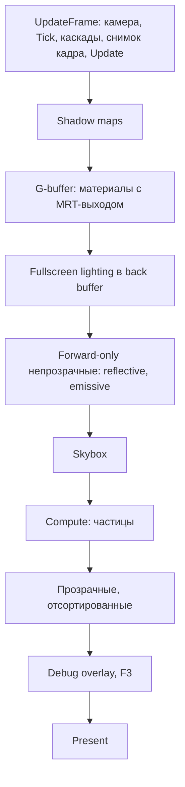

# Устройство проекта и рабочий пайплайн

Документ для разработчиков и их агентов. Состояние исходников на 21 сентября 2026 года, после выполнения работ из «Правки.md» (статус по пунктам — в конце того документа). Подробности демонстрационных задач, состав сцен и их игровая логика намеренно опущены.

## 1. Что представляет собой проект

Это Windows-приложение на C++17 с собственным небольшим компонентным движком и рендером Direct3D 11. В одном исполняемом проекте объединены окно, ввод, камера, объекты сцены, загрузка моделей и текстур, шейдеры, освещение, каскадные тени, инстансинг и GPU-частицы.

Архитектура объектная: сцена содержит наследников `GameComponent`, которые хранят свои данные и умеют себя нарисовать. Порядок кадра и проходы рендера принадлежат `Game`. Это не ECS и не граф рендер-проходов. На CPU всё идет последовательно в основном потоке через один immediate context; compute shaders частиц исполняются на GPU.

В коде три режима `RenderType`: `Forward`, `Deffered`, `Custom`. Написание `Deffered`/`DrawDeffered` — существующие имена API. Режим можно переключать во время работы (F5), шейдерные варианты выбираются в момент прохода.

Полные Forward- и Deferred-кадры реализованы в самом `Game` (`DrawForward`, `DrawDeffered`). Наследники меняют только логику сцены (`PreUpdate`, `TickComponents`), цвет очистки (`GetClearColor`) или, для учебных сцен с режимом `Custom`, собственный `Draw`.

## 2. Карта исходников

Пути в таблице указаны относительно корня репозитория.

| Путь | Назначение |
|---|---|
| `README.md` | Подготовка окружения, сборка, запуск, горячие клавиши |
| `1_Lab/1_Lab.sln`, `1_Lab/1_Lab.vcxproj` | Решение и проект MSBuild (toolset v145, C++17, Win32/x64) |
| `1_Lab/vcpkg.json` | Манифест зависимостей (Assimp) с закрепленным baseline |
| `1_Lab/Source/StartMain.cpp` | Точка входа: поиск каталога проекта, выбор сцены, настройка и регистрация объектов |
| `Public/MainGame/BaseGameClass/Game.h` и `.cpp` | Жизненный цикл, устройство, реестр сцены, кадр, все проходы рендера, тени, deferred |
| `Public/Render/ShaderConstants.h` | C++-layout константных буферов и снимок кадра `FrameConstants` |
| `Public/Render/ShaderCompiler.h` | Единая политика компиляции HLSL (Debug/Release) |
| `Public/Render/TextureLoader.h`, `Private/Render/TextureLoader.cpp` | Загрузка текстур (stb_image) с mip-цепочкой |
| `Public/Components/GameComponents.h` и `.cpp` | `GameComponent`: transform, константы объекта, draw, shadow, инстансинг |
| `Components/SpecificComponents` | Примитивы, `SphereComponent`, `FBXComponent`, `ParticleSystemComponent` |
| `Components/Light` | `PointLightComponent`, `SkyboxComponent` |
| `MainGame/Player.*` | Камера |
| `Display/Display.*` | Win32-окно, `WindowProc` (Raw Input, resize, фокус) |
| `InputDevice` | Состояние клавиш и мыши за кадр, делегаты |
| `MainGame/SpecialGameClasses` | Сцены лабораторных: `SunGame`, `KatamariGame`, `PongGame` |
| `1_Lab/Source/Shaders` | HLSL, компилируемый во время работы; `Common.hlsli` — общий контракт |
| `1_Lab/Source/Models` | Модели и текстуры |
| `1_Lab/Source/includes` | GLM и `stb/stb_image.h` (вендорные копии) |

Пути с началом `Public`/`Private` относятся к `1_Lab/Source`. Каталоги `Debug`, `Release`, `x64`, `.vs`, `vcpkg_installed` — результаты сборки, они исключены `.gitignore` и не отслеживаются Git.

## 3. Окружение

- Visual Studio с MSBuild и toolset **v145**, Windows SDK 10.
- **vcpkg** в manifest-режиме: при сборке MSBuild сам ставит Assimp в `1_Lab/vcpkg_installed/<triplet>` (x86-windows для Win32, x64-windows для x64). Корень vcpkg берется из `VCPKG_ROOT`, иначе `C:\vcpkg\`. Версии закреплены полем `builtin-baseline` в `vcpkg.json`.
- Runtime DLL (Assimp и его зависимости) vcpkg копирует рядом с `.exe` при сборке нужной разрядности.
- stb_image лежит в `Source/includes/stb`; реализация (`STB_IMAGE_IMPLEMENTATION`) — в `TextureLoader.cpp`.
- Все четыре конфигурации решения сопоставлены одноименным конфигурациям проекта.

Пути во время работы: `main` ищет каталог, содержащий `Source/Shaders/Common.hlsli`, начиная с рабочей директории и с каталога `.exe` (вверх по дереву), и делает его текущим. Переменная `ENGINE_PROJECT_DIR` задает его явно. Корень ассетов сцен — родитель каталога проекта (`..`), переопределяется `ENGINE_CONTENT_ROOT`. Файлы ассетов (`cosy.jpg`, `.obj`-модели) в репозиторий не входят; при их отсутствии загрузка сообщает об ошибке, а приложение продолжает работу.

## 4. Инициализация

Путь запуска: `main → найти каталог проекта → создать наследника Game → Initialize → настройка сцены → RegisterComponent → StartGame → Run`.

`Game::Initialize()` возвращает `bool`. При любой ошибке он печатает причину, освобождает всё созданное и возвращает `false`; `main` в этом случае завершается с кодом 1, не входя в цикл.

1. `Display` создает окно с клиентской областью ровно заданного размера и связывает его с `Game` через `GWLP_USERDATA`.
2. `Player`, `InputDevice` (Raw Input клавиатуры и мыши).
3. Устройство и swap chain: допускаются только feature level 11_1/11_0 (нужны SM5 и compute). В Debug сначала пробуется debug layer.
4. Back buffer RTV и depth (DSV + SRV). Представления публикуются только после создания всех.
5. Базовые шейдеры (`RotatedFigure.hlsl`), общие input layouts (`Primitive`, `Mesh`), rasterizer/blend/depth states, GPU-таймер.

G-buffer создается лениво при первом deferred-кадре, shadow maps — при первом кадре с включенными тенями.

## 5. Регистрация и владение

```cpp
RegisterResult RegisterComponent(const std::string& Name, GameComponent* Component,
                                 const std::string& PShaderName = {}, const std::string& VShaderName = {});
bool UnregisterComponent(const std::string& Name);
GameComponent* FindComponent(const std::string& Name) const;
```

Порядок аргументов — сначала pixel shader, затем vertex shader; пустое имя означает `RotatedFigure.hlsl`.

Все проверки (null, пустое имя, нет устройства, повторное имя) выполняются до побочных эффектов. При `Ok` сцена забирает владение (`std::unique_ptr` в `Components`); при ошибке ничего не меняется, и объект остается у вызывающего. Источники света дополнительно попадают в `PointLights`, но только как наблюдатели. `UnregisterComponent` удаляет объект, убирает его из списка света и обнуляет ссылки на него как на родителя (включая инстансы).

Экземпляры (`CreateInstance`, `CreateSphereInstance`) принадлежат владельцу-шаблону (`unique_ptr` в `InstanceArray`); обе фабрики сразу устанавливают `Game`. D3D-ресурсы компонентов и `Game` — `ComPtr`. Cubemap и шейдеры принадлежат кешам `Game`, компоненты хранят на них невладеющие указатели. У `Game` виртуальный деструктор; при уничтожении сначала освобождаются компоненты, затем кеши, затем устройство и окно.

Для модели порядок: `FBXComponent` → `SetGame` → `LoadModel` → при необходимости `LoadTexture` → `RegisterComponent`. `LoadModel` без устройства тоже допустим: GPU-буферы создадутся при регистрации.

| Метод | Ответственность |
|---|---|
| `Tick(dt)` | Поведение; для сферы — и ее инстансов, для частиц — шаг симуляции |
| `Update()` | World matrix, normal matrix и константы объекта из снимка кадра; мировые матрицы инстансов. GPU-вызовов нет |
| `Render(context)` | Только отправка: input layout, topology, буферы, ресурсы, draw |
| `RenderShadow(context, pass)` | Depth-only draw по уже посчитанной world matrix; инстансы рисуются тем же instance stream |
| `DispatchCompute(context)` | GPU-работа раз в кадр независимо от draw (частицы) |

## 6. Трансформации и камера

Локальные position/rotation/scale хранятся в GLM, матрицы строятся через DirectXMath: `Scale * Rotation * Translation`, с родителем — `local * parentWorld`. Переопределяемая точка — `GetLocalMatrix()` (так сделан катящийся шар Katamari).

Кеш мировой матрицы версионный: матрица пересчитывается, если объект помечен dirty или изменилась версия мира родителя. Все сеттеры (`SetPosition`, `SetScale`, `SetRotation*`, `SetParent*`) инвалидируют кеш; код, пишущий поля напрямую, обязан вызвать `MarkTransformDirty`. `SetParent` отвергает циклы. `GetLocalPosition` — локальная позиция, `GetWorldPosition`/`GetCenter` — мировая.

Перед загрузкой в HLSL world matrix транспонируется; normal matrix (inverse-transpose) хранится в том же layout. `Player` возвращает уже транспонированные view/projection. Камера left-handed, FOV 60°, near 0.1, far 10000; режимы свободный и орбитальный.

## 7. Ввод и цикл кадра

`Display::WindowProc` декодирует `WM_INPUT` в переиспользуемый буфер. `InputDevice` за кадр накапливает смещение мыши и колесо, `EndFrame` их сбрасывает. При потере фокуса все клавиши отпускаются.

`Game::Run`:

1. Обработка сообщений. `WM_QUIT` (Escape или закрытие окна) завершает цикл до следующего кадра.
2. Resize на границе кадра: освобождение представлений back buffer, `ResizeBuffers`, пересоздание RTV/depth; G-buffer пересоздается при следующем deferred-кадре. Свернутое окно не рисуется.
3. `UpdateFrame(real dt)`, dt ограничен 0.1 с. Время сцены = реальное × `SimulationTimeScale` (по умолчанию 7.8 — это скорости, под которые подобраны сцены при 60 FPS). Далее: `PreUpdate` → камера → `TickComponents` (Space — пауза) → каскады теней → `BuildFrameConstants` → `Update` всех объектов.
4. `RenderFrame` по `RenderType`.
5. `Present` (VSync переключается F4); потеря устройства или ошибка Present останавливают цикл с кодом 2.
6. Заголовок окна: режим, FPS, CPU ms кадра, GPU ms (timestamp-запросы без ожидания), объекты и инстансы, draw calls, отсеченные объекты.

## 8. Forward-кадр (`Game::DrawForward`)

1. `ClearState`, rasterizer, viewport, очистка back buffer и depth (очистками владеет только рендерер).
2. Shadow maps, если тени активны.
3. Непрозрачные объекты: depth test + write, отсечение по frustum, forward-вариант шейдеров.
4. Skybox: VS прижимает вершины к дальней плоскости, depth `LESS_EQUAL` без записи — он закрашивает только пустые пиксели.
5. Compute-фаза (симуляция и сортировка частиц по глубине текущего кадра).
6. Прозрачные объекты: сортировка от дальних к ближним по расстоянию до камеры, depth test без записи, alpha blending. Пересекающиеся прозрачные меши одной сортировкой объектов не разрешаются.

Каждый draw сам задает input layout, topology и ресурсы, поэтому порядок объектов в реестре не влияет на интерпретацию вершин.

## 9. Deferred-кадр (`Game::DrawDeffered`)



Если deferred-ресурсы создать не удалось, кадр рисуется forward-путем; это корректно, потому что варианты шейдеров выбираются по проходу.

Объект попадает в G-buffer, только если его pixel shader в варианте `DEFERRED_GBUFFER` действительно пишет три render target (проверяется рефлексией шейдера). Остальные непрозрачные материалы рисуются forward-проходом по глубине G-buffer. Сейчас forward-only: `ReflectiveSphere`, `ReflectiveFBX` (G-buffer не хранит cubemap/Френеля) и `InstanceSphereFigure` (эмиссивные звезды, tone mapping).

| Ресурс | Формат | Содержимое |
|---|---|---|
| `gBufferAlbedo` | `R8G8B8A8_UNORM` | rgb — базовый цвет, a — вес спекуляра материала |
| `gBufferNormal` | `R16G16B16A16_FLOAT` | rgb — нормаль `*0.5+0.5`, a — модель ambient (0 плоская, 1 полусферическая) |
| `gBufferWorldPosition` | `R16G16B16A16_FLOAT` | Мировая позиция, w = 1 для записанных пикселей |
| Depth | `R24G8_TYPELESS` / DSV `D24_UNORM_S8_UINT` / SRV `R24_UNORM_X8_TYPELESS` | Геометрия, lighting, коллизии частиц |
| Back buffer | `R8G8B8A8_UNORM` | Финальный LDR-цвет |

Lighting (`RotatedFigure.hlsl`, `DEFERRED_LIGHTING`) вызывает ту же функцию `ComputeSceneLighting`, что и forward-материалы, с параметрами материала из G-buffer, и использует тот же ambient. Пиксели без геометрии отбрасываются, поэтому видны цвет очистки и skybox.

## 10. Шейдеры и CPU/GPU-контракты

Обычные шейдеры: `VSMain`/`PSMain`, `vs_5_0`/`ps_5_0`. Кеш в памяти: ключ = файл | стадия | вариант | политика компиляции; неудачная компиляция тоже запоминается и не повторяется каждый кадр. Debug-сборка компилирует HLSL с debug info без оптимизации, Release — с `OPTIMIZATION_LEVEL3`. `#include` разрешается относительно файла.

`Common.hlsli` содержит cbuffer `b0` (layout = `ConstantBufferData`), контракт G-buffer, выборку теней и `ComputeSceneLighting`. Его подключают `RotatedFigure`, `BaseFBX`, `ReflectiveSphere`, `ReflectiveFBX`. Старые `BaseSphereFigure`, `InstanceSphereFigure`, `Skybox` объявляют префикс того же layout; поля в `ConstantBufferData` можно только добавлять в конец. `BaseShader.hlsl` и `BaseLines.hlsl` сценами не используются.

| Проход / стадия | Bindings |
|---|---|
| Обычная геометрия | `b0`: `ConstantBufferData` |
| Инстансная геометрия | `b0`: `InstConstantBufferData`; VS `t0`: `StructuredBuffer<InstData>` |
| Материалы, PS | `t0/s0` текстура, `t1/s1` cubemap, `t4/s4` shadow array |
| Deferred lighting | `b0`; PS `t0..t3`: albedo, normal, world position, depth; `t4/s4` shadow |
| Shadow | `b0`: `ShadowPassBufferData`; инстансный VS `VSMainInstanced` читает `t0` |
| Частицы | как в `GPUParticleSystem.hlsl`: CS `b0/b1`, `t0`, `t2` depth, `u0/u1`; VS `t0/t1` |

Vertex layouts создаются один раз в `Game` (`GetInputLayout`): `Primitive` — `POSITION float4 + COLOR float4`, stride 32; `Mesh` — position, normal, UV как три `float4`, UV читается как `float2` по offset 32, stride 48. Индексы 32-битные.

## 11. Свет, тени и окружение

`PointLightComponent` не рисуется и не отбрасывает тень. `GetPointLights` отдает первые до восьми источников в порядке регистрации с мировыми позициями. Directional light хранится в `Game` и передается материалам всегда, независимо от теней.

Тени по умолчанию выключены; `SetShadowSettings` включает их. Три каскада `2048²` (`R32_TYPELESS`, DSV `D32_FLOAT`, SRV `R32_FLOAT`), матрицы считаются один раз за кадр до обновления объектов. Прозрачные объекты, skybox, свет и частицы тень не отбрасывают; инстансы — отбрасывают, каждый своей матрицей. Отсечения объектов по каскадам нет.

Cubemap процедурная или из шести файлов, статическая, хранится в `Game::cubeMapCache`.

## 12. Модели, текстуры и инстансинг

`FBXComponent` загружает любые форматы Assimp (в сценах — OBJ). Импорт: triangulation, left-handed, генерация нормалей, `PreTransformVertices` (трансформы узлов запекаются в вершины и нормали), оптимизация мешей. У каждого сабмеша сохраняется diffuse-цвет материала: без текстуры объект рисуется цветом компонента × цвет сабмеша. Скелетной анимации нет.

Кеши моделей (CPU-ассет) и GPU-буферов/текстур разделены, ключи — канонический путь (и устройство для GPU-данных), живут через `weak_ptr` и используются только из основного потока. Частично созданные GPU-ресурсы в кеш не публикуются.

Текстуры загружаются через `TextureLoader` с полной mip-цепочкой (UNORM, без sRGB-конвертации).

Инстансинг: владелец — шаблон, рисуются только его экземпляры (в цвете и в тенях). Instance buffer растет геометрически (емкость и число хранятся раздельно) и загружается один раз за кадр из переиспользуемого staging-массива.

## 13. GPU-частицы

`ParticleSystemComponent` — прозрачный, со своими VS/PS/CS из `GPUParticleSystem.hlsl`. Данные частицы — три `float4`; два structured buffer с SRV/UAV.

- `Tick` — шаг: время сцены × `SimulationRate`, ограничено `MaxSimulationStep`.
- `DispatchCompute`, раз в кадр в compute-фазе после непрозрачной геометрии: симуляция с коллизиями по depth текущего кадра, затем построение ключей и полная bitonic-сортировка (`k(k+1)/2` dispatch для `2^k` элементов). Для порядко-независимых эффектов сортировку можно отключить (`SetSortingEnabled(false)`).
- `Render` — только `DrawInstanced(4, ParticleCount)`.

Emitter как целое сортируется вместе с остальными прозрачными объектами; частицы разных emitter между собой не перемешиваются.

## 14. Как продолжать разработку

Читать начинать с `Game.h/.cpp` (кадр и проходы), затем `GameComponents.h/.cpp`, `ShaderConstants.h`, `Common.hlsli`, `RotatedFigure.hlsl`.

- **Компонент.** Определить геометрию и vertex layout, `Tick`, `CreateBuffers(ID3D11Device*)`, `Render`/`RenderShadow`. Переопределить `IsRenderable`, `CastsShadow`, `SupportsFrustumCulling`, если поведение отличается от умолчаний. Флаги прозрачности и skybox должны быть заданы до регистрации.
- **Материал.** Подключить `Common.hlsli`. Для участия в deferred добавить ветку `DEFERRED_GBUFFER`, которая возвращает `EncodeGBuffer(...)`; без нее материал автоматически считается forward-only.
- **Проход.** Явно задавать targets, shaders, input layout, topology, viewport, rasterizer, blend и depth state; освобождать SRV/UAV/DSV перед повторным использованием ресурса.
- **Ассеты и пути.** Задавать относительно каталога проекта или корня ассетов, не абсолютными путями.

Что осталось направлением развития, а не реализовано: вынос renderer/scene в отдельные классы, render packets и батчинг, back-face culling, сжатие G-buffer, более быстрая сортировка частиц, HDR/sRGB-пайплайн (см. «Правки.md»).
